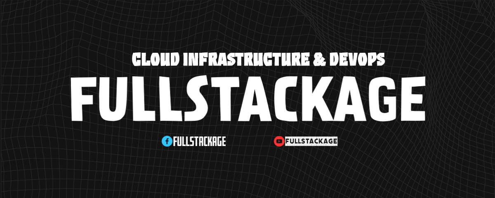

<h1 align="center">Xin chào Mọi người, Mình là Phú!</h1>
<h1 align="center">はじめまして、フーです. 宜しくお願いします!</h1>

 

#### GitHub Stats

|  |  |
| ------------- | ------------- |

<h1>Social Networks</h1>

#### Latest Medium Activities
<!-- MEDIUM:START -->
<!-- MEDIUM:END -->
 
#### Recent Youtube Activities
<!-- YOUTUBE:START -->
<!-- YOUTUBE:END -->
